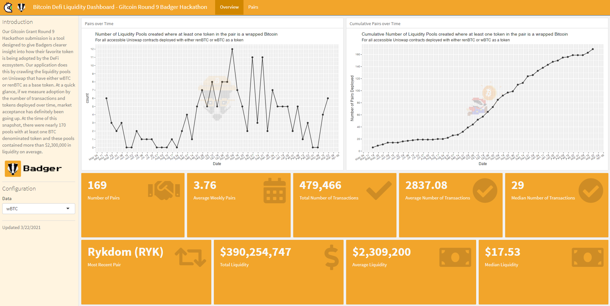

# Gitcoin Grants Round 9 Badger Hackathon Submission

https://crypto.omnianalytics.io/apps/git-9-badger-hack/

# Description

We know the Badger community loves Bitcoin as much as we love analytics and it's that shared love that motivated our submission for Round 9 of the Gitcoin Grants Hackathon.  Over the course of the last couple of weeks we've developed an open source Bitcoin Liquidity Dashboard designed to track Bitcoin adoption on Ethereum.  To accomplish this, we used Uniswap's subgraphs to pull information on all the liquidity pools that had a wrapped Bitcoin in its pair. This turned out to be about 170 pairs. The data collected also included amount of liquidity in the pool at the time of query and a time stamp on when the contract was deployed.  We crunched a few numbers in R, made some plots and then arranged this information into a neat dashboard. We hope you find it useful.

Check out the [video demo here](https://youtu.be/chgqxQdgjGc).

Play with the [app here](https://crypto.omnianalytics.io/apps/git-9-badger-hack/).

# About Us

Omni Analytics Group is an incorporated group of passionate technologists who help others use data science to change the world. Our practice of data science leads us into many exciting areas where we enthusiastically apply our machine learning, artificial intelligence and analysis skills. Our flavor for 2021, the blockchain! To learn more about what we do or just to have fun, join us over on [Twitter](https://twitter.com/OmniAnalytics).
